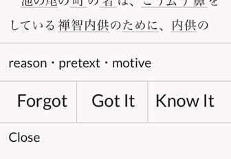
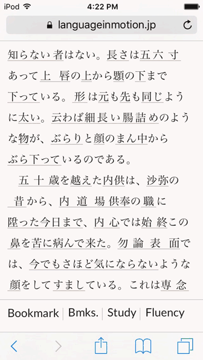
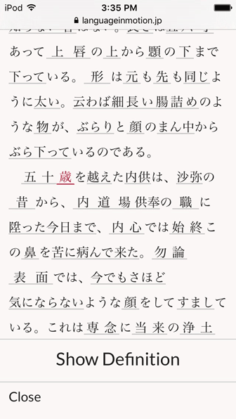

# Language in Motion

### A digital library of classic Japanese short stories for students of the Japanese language and people with literary interest.

Japanese, like any language, is caught up in the lives of those who use it. Dictionaries and textbooks at best give a small number of abstractions by a small number of men. While the fluid, bizarre, human Japanese language makes its home in literature. For both the student of the Japanese language and the interested reader, however, reading Japanese literature without already having a sizable vocabulary is tedious. So, Language in Motion is an attempt to make reading Japanese literature pleasurable, even without a good vocabulary. For that purpose…

### Hand-edited dictionary

Open a book, and almost every word (kanji and hiragana) can be clicked to immediately display its English definition at the bottom of the screen.

And every word has been reviewed manually by a human (me), so the definitions you see are reliable and comprehensive. For example, multiple words that form an idiom are grouped together with a single definition. And where the dictionary had no definition or was lacking, I have translated and added definitions from Japanese sources. Moreover, the stories collected here are classics that were written around a hundred years ago when Japanese sometimes used kanji and readings different from those of modern Japanese. Some words you won’t even find in modern dictionaries. These words, too, have been defined and confirmed for accuracy, frequently using footnotes in Japanese printed editions of the stories.

In other words, everything you need to understand these stories is here.

### Flashcard-like vocabulary building
### (4,600 words. Contains 64% of all commonly used kanji.)

Any time you pull up the definition for a word, you have the option to record how well you know it.

In other words, every word is like a flashcard. But since the words are always in the context of the text, the meaning you memorize will be more nuanced and usable in your own life.

Both when reading and when recording your knowledge of words, you can view your fluency in a book by clicking “Fluency” which will color-code each word according to how well you know it.

For those who are mainly interested in vocabulary building, you can automatically jump from one word to the next (still within the text) with the definition initially hidden.

The words are presented using spaced repetition. You can also navigate through every use of a word in a book, thus getting a sense of its nuances.

Lastly, when you record how well you know a word in one book, that score is applied to that word in every book it appears in. In this way, you can see how much of a book you can read fluently even before opening it.

### Classic short stories

There are 10 classic short stories by Akutagawa Ryūnosuke, Natsume Sōseki, Mori Ōgai, and Miyazawa Kenji.

The stories were selected so as to include as many representative works of the authors as possible, but lesser-known works have also been included for both being enjoyable and presenting new linguistic challenges.

In addition, I have added English titles and blurbs to each story so that without any former knowledge you can find those that interest you. Check out the library.

### Read in your web browser, mobile or desktop

Reading is all done through this website, so any device with a web browser and an internet connection can be used. Layout and typography have been made so that on both mobile devices and desktop computers reading is as pleasant as possible.

### How much Japanese must I know?

You should thoroughly understand Japanese grammar and know enough vocabulary to read children’s books. If you are currently at ease in simple conversation but feel like your conversation is just bland (e.g. in your English-speaking mind you say: The universe overwhelms my senses like an interstellar waltz! But I don’t know how to say that in Japanese, so… 「はい、元気です 」), then you may benefit from these stories.

However, the best way to find out is to create a free account below and try it out.

(More on how much grammar you must understand.)

### Try

You can try out Language in Motion for free, with access to 3 books (1 book of each difficulty level: Easy, Intermediate, and Advanced). ~~Sign up for free~~

Update June 13, 2017: Language in Motion is shutting down.

### Become a subscriber

If you would like to access all 10 books, you can subscribe for ¥2,500/year. ~~Sign up and subscribe~~

Update June 13, 2017: Language in Motion is shutting down.

You may cancel your subscription or delete your account at any time. And of course, if you have any questions feel free to contact me.

Sincerely,
Stephen
